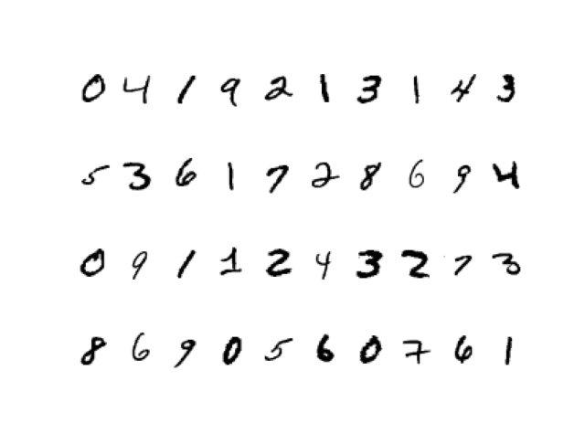

# 卷积神经网络(CNN)识别MNIST数据集

<!-- PROJECT SHIELDS -->
<!--
*** I'm using markdown "reference style" links for readability.
*** Reference links are enclosed in brackets [ ] instead of parentheses ( ).
*** See the bottom of this document for the declaration of the reference variables
*** for contributors-url, forks-url, etc. This is an optional, concise syntax you may use.
*** https://www.markdownguide.org/basic-syntax/#reference-style-links
-->
[![Contributors][contributors-shield]][contributors-url]
[![Forks][forks-shield]][forks-url]
[![Stargazers][stars-shield]][stars-url]
[![Issues][issues-shield]][issues-url]
[![MIT License][license-shield]][license-url]
[![LinkedIn][linkedin-shield]][linkedin-url]


<!-- PROJECT LOGO -->
<br />
<p align="center">
  <a href="https://github.com/ygrayson/cnn_mnist">
    
  </a>

  <h3 align="center">卷积神经网络CNN识别手写数字MNIST数据集</h3>
  <p align="center">
    机器学习界的果蝇实验，欢迎参考
  </p>
</p>


<!-- TABLE OF CONTENTS -->
## 目录

* [简介](#简介)
  * [使用工具](#使用工具)
* [安装](#安装)
  * [语言](#语言)
  * [平台](#平台)
* [开始识别数字！](#开始识别数字吧！)
  * [载入数据](#载入数据)
  * [看看数据啥样儿](#看看数据啥样儿)
  * [建立模型](#建立模型)
  * [训练模型](#训练模型)
  * [测试模型](#测试模型)
* [联系我](#联系我)
* [致谢](#致谢)


<!-- ABOUT THE PROJECT -->
## 简介

深度学习发展迅速，MNIST手写数字数据集作为机器学习早期的数据集已经被公认为是机器学习界的果蝇实验（Hinton某年)，卷积神经网络是识别图像非常有效的一种架构，于是用<b>CNN识别手写数字</b>也就成为了机器学习界的经典实验。在这个repo中我会呈现最基本的CNN识别MNIST数据集过程。
主要步骤如下：
* [载入数据](#载入数据)
* [看看数据啥样儿（也即Visualization）](#看看数据啥样儿)
* [建立模型](#建立模型)
* [训练模型](#测试模型)
* [测试模型（看看训练的好不好）](#测试模型)


### 使用工具
主要使用的语言和平台如下：
* 语言 - [Python](https://www.python.org/)
* 平台 - [Pytorch](https://pytorch.org/)


<!-- GETTING STARTED -->
## 安装

安装包括Python语言和几个必备的Pytorch包，使用Linux系统的安装方式如下:

### 语言
检查一下Python语言：
* Python
```sh
$ python3 --version
Python 3.7.7
```

### Pytorch包
1. 安装Pytorch
```sh
pip install torch
```
2. 安装Torchvision
```sh
pip install torchvision
```

3. 安装Matplotlib
```sh
pip install matplotlib
```


<!-- Start Recognizing Digits -->
## 开始识别数字吧！

完成了安装，我们就可以开始训练神经网络识别数字了，第一步载入数据。


### 载入数据

首先载入数据，全部MNIST手写数字数据集来自于[Yann LeCun网站](http://yann.lecun.com/exdb/mnist/)，这里我们使用torchvision.datasets里已经有的MNIST数据集，与从网站下载效果相同：
```python
from torchvision.datasets import MNIST
train_data = MNIST(root='./data', train=True, download=True, transform=transform)
test_data = MNIST(root='./data', train=False, download=True, transform=transform)
```

### 看看数据啥样儿

要想建立一个好的模型，首先我们要熟悉所处理的数据集是怎样的，MNIST的数据集中每一张手写数字图片均是灰度的28*28的图片，同上配有一个正确的0-9的label。先来一起看看训练集和测试集：
```python
print(train_data)
```
```
Dataset MNIST
    Number of datapoints: 60000
    Root location: ./data
    Split: Train
    StandardTransform
Transform: Compose(
               ToTensor()
               Normalize(mean=(0.5,), std=(0.5,))
           )
```
```python
print(test_data)
```
```
Dataset MNIST
    Number of datapoints: 10000
    Root location: ./data
    Split: Test
    StandardTransform
Transform: Compose(
               ToTensor()
               Normalize(mean=(0.5,), std=(0.5,))
           )
```

训练集中有60000个手写数字及其label，测试集有10000个，接下来我们看看手写数字长啥样儿：

```python
# 展示前40张手写数字
import matplotlib.pyplot as plt

num_of_images = 40
for index in range(1, num_of_images + 1):
    plt.subplot(4, 10, index)
    plt.axis('off')
    plt.imshow(train_data.data[index], cmap='gray_r')
plt.show()
```
这段code用matplotlib画出前四十张训练集里的手写数字，在同一张图里呈现，图如下：

我们的任务就是通过只看到手写数字的图片，建立一个CNN模型成功的识别出它是0-9的哪一个数字。

### 建立模型


### 训练模型


### 测试模型


<!-- Contact Me -->
## 联系我

Qianbo Yin - [@LinkedIn](https://www.linkedin.com/in/qianbo-yin-a91861114/)

Project Link: [https://github.com/ygrayson/cnn_mnist](https://github.com/ygrayson/cnn_mnist)


<!-- ACKNOWLEDGEMENTS -->
## 致谢
* [MNIST手写数字数据集](http://yann.lecun.com/exdb/mnist/)
* [Img Shields](https://shields.io)
* [Choose an Open Source License](https://choosealicense.com)
* [GitHub Pages](https://pages.github.com)
* [Animate.css](https://daneden.github.io/animate.css)
* [Loaders.css](https://connoratherton.com/loaders)
* [Slick Carousel](https://kenwheeler.github.io/slick)
* [Smooth Scroll](https://github.com/cferdinandi/smooth-scroll)
* [Sticky Kit](http://leafo.net/sticky-kit)
* [JVectorMap](http://jvectormap.com)
* README.md created with [Best-README-Template](https://github.com/othneildrew/Best-README-Template)


<!-- MARKDOWN LINKS & IMAGES -->
<!-- https://www.markdownguide.org/basic-syntax/#reference-style-links -->
[contributors-shield]: https://img.shields.io/github/contributors/othneildrew/Best-README-Template.svg?style=flat-square
[contributors-url]: https://github.com/othneildrew/Best-README-Template/graphs/contributors
[forks-shield]: https://img.shields.io/github/forks/othneildrew/Best-README-Template.svg?style=flat-square
[forks-url]: https://github.com/othneildrew/Best-README-Template/network/members
[stars-shield]: https://img.shields.io/github/stars/othneildrew/Best-README-Template.svg?style=flat-square
[stars-url]: https://github.com/othneildrew/Best-README-Template/stargazers
[issues-shield]: https://img.shields.io/github/issues/othneildrew/Best-README-Template.svg?style=flat-square
[issues-url]: https://github.com/othneildrew/Best-README-Template/issues
[license-shield]: https://img.shields.io/github/license/othneildrew/Best-README-Template.svg?style=flat-square
[license-url]: https://github.com/othneildrew/Best-README-Template/blob/master/LICENSE.txt
[linkedin-shield]: https://img.shields.io/badge/-LinkedIn-black.svg?style=flat-square&logo=linkedin&colorB=555
[linkedin-url]: https://linkedin.com/in/othneildrew
[product-screenshot]: images/screenshot.png
